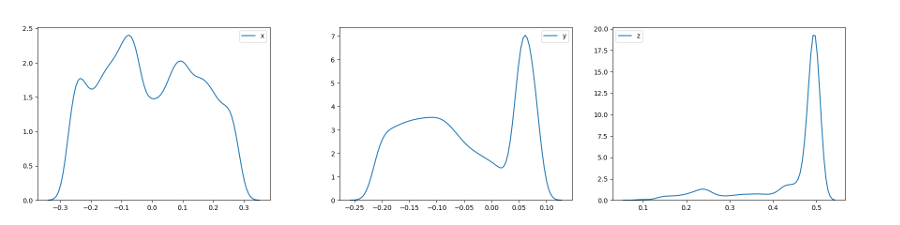
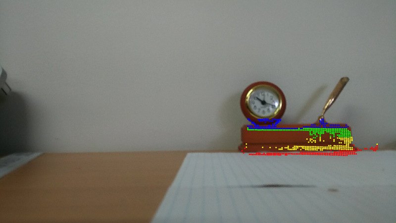

# 3D Models Using TangoCamera
1. Take a photo with TangoCamera with point clouds enabled in the settings (the default is enabled)
   of the object to be modelled.  It is easiest if the item is isolated against a wall or if a large
   room is available then with nothing behind the object. It can also make it easier if some
   measureable frame of reference is placed in the scene, for example a ruler. In the example below
   two A4 pages are placed in front of the object (the width of an A4 page being 210mm).
   

1. Copy the 3 files created by TangoCamera from the DCIM/TangoCamera directory into a local directory using adb, Android Studio Device Explorer or via a USB    mount. For the purposes of this example it is assumed the files are copied into a sub-directory called data, for example:

   ```
   adb pull /sdcard/DCIM/TangoCamera
   mv TangoCamera data
   ```
   Also copy the 3 python scripts from the Analysis directory into the current directory.

1. To view stats involving the point cloud use ply-analysis.py:

   ```
   -h, --help           show this help message and exit
   -s, --stats          Print stats
   -d, --distributions  Show probability distributions for x, y and z.
   --Jxy                Show joint probability distribution for x and y.
   --Jxz                Show joint probability distribution for x and z.
   --Jyz                Show joint probability distribution for y and z.
   -b, --box            Show boxplot.
   ```

   **Note:** requires python packages numpy, pandas, matplotlib, seaborn and [plyfile](https://github.com/dranjan/python-plyfile).
   eg python ply-analysis.py data/20171122163055.165-94478.413933571.ply -s -d -b
   ```
                     x             y             z
   count  25038.000000  25038.000000  25038.000000
   mean      -0.005537     -0.051417      0.442446
   std        0.156137      0.095564      0.096354
   min       -0.277612     -0.220043      0.092123
   25%       -0.133545     -0.135179      0.435486
   50%       -0.017069     -0.061922      0.492052
   75%        0.124652      0.052491      0.497753
   max        0.289132      0.089715      0.503673
   ```
   

1. From the distributions we can infer the most likely point ranges and use
   ply-filter.py to create a modified point cloud. In this case we will filter
   Z between  0.40 and 0.485 (-Z 0.40 --ze 0.485) and Y less than 0.050101
   (-y 0.050101) (note the point cloud coordinate system is defined as
   "+Z points in the direction of the camera's optical axis, perpendicular to the plane of the camera.
    +X points toward the user's right, and +Y points toward the bottom of the screen. The origin is the focal center
    of the depth camera.", ie similar to OpenCV. Point cloud coordinates are in metres).
    the command line for this is:
    ```
    python3 ply-filter.py -i -Z 0.40 --ze 0.485 -y 0.050101 data/20171122163055.165-94478.413933571.ply -o test.ply
    ```

1. Finally the filtered result can be checked by projecting the 3D points onto the image
   using project.py (requires [numpy-quaternion](https://github.com/moble/quaternion) and
   python-opencv):
   
   Note the code for project.py is still experimental and a bit of a mess. In particular the projections
   Y translation is off. Subtracting the translation between the color camera and the IMU
   (see ["Coordinate frames for component alignment"](https://developers.google.com/tango/overview/frames-of-reference#coordinate_frames_for_component_alignment))
   seems to solve it, but its only tested on a Zenfone. Regardless, the identified points should be usable where 3D
   model points are required, eg for testing PnP style pose algorithms. For algorithms which have issues with co-planar
   points, it might be a good idea to allow Z color coding, rather than the Y color coding illustrated above, to help
   select non co-planar points.
